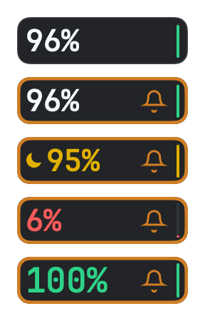

# Reset announcement reminder

Validated on September 12, 2026, for CodexBarSimple 1.3.0.

The app checks the [public status endpoint](https://codex-resets.com/api/v1/status) at launch and every
600 seconds, independently of the existing one-minute usage refresh. The request has a 15-second timeout,
bypasses the local HTTP cache, requests revalidation, and sends no cookies or account credentials.

An orange border requires `data.scheduled_reset.status == "scheduled"` and `reset_type == "regular"`.
Forecast probabilities, completed resets, and banked reset credits do not qualify. An unknown or elapsed
`scheduled_for` time does not override the feed's execution state, as specified in the
[API schema](https://codex-resets.com/api/openapi.json). A failed request clears the reminder until the next
successful check.

The card has no text label beside the percentage. A confirmed upcoming reset adds the supplied TRAE bell
icon in that space. Each newly observed announcement ID triggers a 60-second, left-right swing, after which
the bell remains still. Repeated polling and temporary feed failures do not replay the same announcement
during the running app session. The bell disappears when the feed no longer confirms the pending reset.

## Checks

- `make test` and `make check`: 25 tests in seven suites passed, including eight announcement scenarios and
  five HTTP scenarios in the parameterized tests.
- Local HTTP stubs verify request URL, method, timeout, cache policy, and absence of credentials or cookies.
- State transitions cover pending, completed, pending again, offline, and recovery.
- Startup polling and cancellation of the ten-minute wait are covered without real account access.
- Bell tests cover opposite swing directions, the 60-second cutoff, duplicate announcements, recovery, and
  a new announcement replacing the previous one. The animation task uses a monotonic clock and stops
  redrawing when the minute ends, the announcement clears, or the app quits.
- Rendering 20 bell preview frames at 3× scale, including GIF generation, averaged about 0.82 ms per frame
  on the development machine. This is an offscreen rendering measurement, not a full runtime CPU profile.
- The live public endpoint returned HTTP 200 with no pending announcement during validation; a completed
  reset alone correctly leaves the border inactive.
- The orange outline is drawn inside the original 80 × 22 pt card, using TRAE's `status-warning-default`
  color (`#D27E24`) at 1.5 pt. It does not change the percentage layout or colors.
- The packaged installer updated the local app to 1.3.0. The installed ad-hoc signature verifies and the
  per-user LaunchAgent is running.

The rendering fixture below shows, from top to bottom: normal display, pending reset, Luna Reserve with a
pending reset, low quota with a pending reset, and the existing quota-reset animation with a pending reset.
These are simulated states, not an announcement that a reset is currently pending.

One repeating swing cycle is shown below for illustration. The app stops the animation after one minute.

